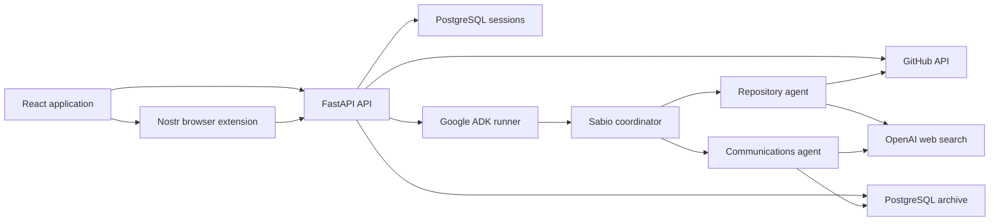

# Sabio

Sabio is a Bitcoin protocol intelligence application that brings source code,
repository activity, technical discussions, and contributor identities into one
searchable, source-grounded workspace.

Instead of answering only from model memory, Sabio routes questions to specialist
agents that can inspect configured GitHub repositories, search a local archive of
Bitcoin development discussions, resolve people across multiple identities, and
retrieve the primary evidence used in an answer.

## What Sabio can do

- **Grounded chat** — ask about commits, pull requests, issues, source code, BIPs,
  contributors, mailing-list conversations, or BitcoinTalk discussions.
- **Interactive citations** — code references open the exact cited line range in a
  side panel; communication references open the archived message and link to its
  original source.
- **Multimodal questions** — attach PNG, JPEG, WebP, or GIF images for direct model
  inspection.
- **Typed context attachments** — attach a configured repository, a known person,
  a complete source file, or a highlighted code range to a message.
- **Repository browser** — inspect branches, trees, files, blame, commits, and diffs
  without cloning the repository locally.
- **People directory** — search identities linked across mailing lists, GitHub, and
  BitcoinTalk and inspect their messages and commits.
- **Persistent conversations** — chat sessions are scoped to a Nostr identity and
  stored in PostgreSQL.
- **Current web research** — agents can use OpenAI web search when the local archive
  or repository tools are not the right primary source.

Example questions:

- “What changed in Bitcoin Core during the last week?”
- “How does `MAX_BLOCK_WEIGHT` flow through validation?”
- “Compare the current Core and Knots implementations of this feature.”
- “What did Satoshi say about transaction fees? Show the original messages.”
- “What has this contributor worked on recently?”
- “Explain the diagram in this attached image.”

## Data coverage

Sabio currently understands these configured repositories:

| Alias | Repository |
| --- | --- |
| `core` | `bitcoin/bitcoin` |
| `knots` | `bitcoinknots/bitcoin` |
| `bips` | `bitcoin/bips` |
| `secp256k1` | `bitcoin-core/secp256k1` |

The communications archive can contain:

- `bitcoin-dev`
- Historical metzdowd cryptography-list threads
- Historical SourceForge `bitcoin-list` threads
- `p2p-research`
- BitcoinTalk’s Development & Technical Discussion board

Repository data is read from GitHub on demand. Communication and identity data must
be loaded into PostgreSQL using the ingestion commands described below.

## Architecture



The main application layers are:

- **Frontend:** React 19, TypeScript, Vite, Tailwind CSS, Base UI, Monaco Editor,
  TanStack Query, and React Router.
- **API:** FastAPI endpoints for authentication, chat streaming, repository browsing,
  archived messages, and people.
- **Agents:** Google ADK agents using LiteLLM and OpenAI models. The coordinator
  delegates to repository and communications specialists.
- **Storage:** PostgreSQL stores messages, normalized people and aliases, full-text
  search indexes, and ADK conversation events.
- **External data:** GitHub supplies live repository information; OpenAI supplies the
  language models and optional web search.

## Prerequisites

- Python **3.12.11** (the pinned version is in `.python-version`)
- Node.js **22.12+** (Vite 8 requires a current Node runtime)
- Docker with Docker Compose
- An OpenAI API key
- A NIP-07-compatible Nostr browser extension for interactive login
- A GitHub token is strongly recommended to avoid unauthenticated API rate limits

## Local setup

### 1. Install dependencies

```bash
git clone <repository-url>
cd sabio-bitcoin

python -m venv .venv
source .venv/bin/activate

make install
make frontend-install
```

On Windows, activate the virtual environment with the command appropriate for your
shell before running the remaining steps.

### 2. Configure the environment

Copy the template:

```bash
cp .env.example .env
```

Then set at least `OPENAI_API_KEY` and `SESSION_SECRET`. Generate a session secret
with:

```bash
python -c "import secrets; print(secrets.token_urlsafe(32))"
```

Environment variables:

| Variable | Required | Purpose |
| --- | --- | --- |
| `OPENAI_API_KEY` | Yes | Runs the ADK/LiteLLM agents and OpenAI web search. |
| `SESSION_SECRET` | Yes | Signs the browser session cookie used by Nostr login. |
| `DATABASE_URL` | Yes | PostgreSQL connection used by the API, agents, jobs, and migrations. |
| `OPENAI_WEB_SEARCH_MODEL` | No | Overrides the Responses API model used by `search_web`; defaults to `gpt-5.6`. |
| `GITHUB_TOKEN` | Recommended | Raises GitHub API limits for repository views and agent tools. |
| `POSTGRES_USER` | Local DB only | Docker Compose database user. |
| `POSTGRES_PASSWORD` | Local DB only | Docker Compose database password. |
| `POSTGRES_DB` | Local DB only | Docker Compose database name. |
| `POSTGRES_PORT` | Local DB only | Host port for PostgreSQL; the project template uses `5434`. |

Do not commit `.env`; it is ignored by Git.

### 3. Start and migrate PostgreSQL

```bash
make dev
```

This starts the PostgreSQL container and applies every migration in
`db/migrations/`.

### 4. Run the application

Run all development processes together:

```bash
make dev-all
```

This starts:

| Service | URL | Notes |
| --- | --- | --- |
| Frontend | `http://localhost:5173` | Main Sabio application |
| Backend | `http://localhost:8010` | FastAPI API |
| ADK web UI | `http://localhost:8000` | Optional agent-development interface |

`make dev-all` does not start or migrate PostgreSQL, so run `make dev` once first.
Press `Ctrl+C` to stop the foreground development processes.

To run services separately:

```bash
make backend
make frontend
make agents
```

Use separate terminals for those commands. The main app only requires the backend
and frontend; `make agents` provides Google ADK’s development UI.

## Load the research archive

The application can browse GitHub immediately, but communication search and the
people directory need local data.

### Mailing lists and early archives

```bash
make backfill
```

This loads the main `bitcoin-dev` archive and the historical precursor archives. The
loaders are designed to be safely rerun.

### BitcoinTalk history

For the one-time complete historical import:

```bash
make backfill-bitcointalk-history
```

This is a slow discovery and ingestion pass. It is safe to interrupt and resume
because posts are deduplicated by their external identifiers.

For a smaller ongoing recency-based crawl:

```bash
make scrape-bitcointalk
```

### IRC history

After applying the IRC migration, run the complete historical import once:

```bash
make backfill-irc
```

The importer is deliberately limited to `bitcoin-core-dev` and
`bitcoin-core-pr-reviews`. It discards connection events, log markers, meeting
bots, GitHub bots, empty lines, and meeting boundary commands before insertion.
Human messages and actions are linked to IRC people; a curated set of established
contributors is reconciled with existing GitHub identities and aliases.

For a bounded preview with no database connection:

```bash
python scripts/ingest_gnusha_irc.py \
  --since 2025-01-01 \
  --max-files 2 \
  --dry-run
```

### Link GitHub identities

```bash
make link-github
```

This walks configured repository histories and links commit-author identities to
GitHub accounts. It can take a significant amount of time, especially for large
repositories; a GitHub token is strongly recommended.

### Incremental synchronization

The repository contains idempotent jobs suitable for cron or another scheduler:

```bash
python -m jobs.sync_mailing_list
python -m jobs.sync_bitcointalk
python -m jobs.sync_irc
```

Run the full mailing-list backfill before its incremental job. No scheduler is
installed automatically by this project. The IRC job refetches a fixed seven-day
window for each channel and inserts only source line numbers that are not already
present. This also handles noise-only days, which intentionally create no database
row that could serve as a watermark.

For example, a daily cron entry could run:

```cron
17 3 * * * cd /path/to/sabio-bitcoin && .venv/bin/python -m jobs.sync_irc
```

## Authentication and chat sessions

Sabio does not store passwords or private keys. Login uses a NIP-42-style
challenge:

1. The backend issues a short-lived, single-use nonce.
2. A NIP-07 browser extension signs an authentication event.
3. The backend verifies the event and stores only the public key in a signed cookie.
4. The public key becomes the user identifier for persisted ADK sessions.

Conversation history, attachment metadata, tool activity, and citations survive page
reloads. Sessions remain available until the user deletes them.

Image attachments are validated on both the client and server:

- PNG, JPEG, WebP, and GIF
- Up to 4 images per message
- Up to 5 MB per image
- Images are sent to the model as multimodal input parts

Chat requests also accept a `locale` of `en` or `es` (`en` by default). The
sidebar language switch persists the app locale and translates the interface,
dates, activity labels, and chat controls. The frontend sends that same locale
with each chat request. Sabio keeps one canonical set of agent instructions and
adds response-language guidance per request, preserving source quotations,
code, identifiers, and URLs in their original form.

## Testing

Run the Python test suite:

```bash
pytest -q
```

Check and build the frontend:

```bash
cd frontend
npm run lint
npm run build
```

Run the Playwright browser suite. It starts Vite automatically and uses
deterministic API/SSE mocks, so it does not require PostgreSQL, a Nostr
extension, external APIs, or an OpenAI key:

```bash
cd frontend
npx playwright install chromium # first run only
npm run test:e2e
```

The browser suite covers language switching and persistence, exact chat
request payloads, streamed responses, image selection, repository/person
context, run-specific Stop requests, and persisted-session loading/deletion.
Failure artifacts are written to `frontend/test-results/`;
`npm run test:e2e:ui` opens Playwright's interactive runner.

With PostgreSQL, the backend, and the frontend running, exercise Nostr login,
streaming chat, persistence, and cleanup using a disposable in-memory identity:

```bash
python scripts/smoke_sessions.py
```

Optional source-specific smoke tests make real model and data-source calls:

```bash
python scripts/smoke_sessions.py --expect-source
python scripts/smoke_sessions.py --expect-communication-source
```

The smoke script deletes the session it creates before exiting.

## Production build

The multi-stage Docker image builds the frontend and serves it from FastAPI, so the
production application uses a single origin:

```bash
docker build -t sabio-bitcoin .
docker run --rm -p 8080:8080 --env-file .env sabio-bitcoin
```

The `DATABASE_URL` used inside the container must point to a PostgreSQL server
reachable from that container; a host-local `localhost` URL will point back to the
container itself.

The included `fly.toml` deploys the image to Fly.io:

```bash
fly secrets set \
  OPENAI_API_KEY="<key>" \
  SESSION_SECRET="<secret>" \
  DATABASE_URL="<postgres-url>" \
  GITHUB_TOKEN="<token>"

fly deploy
```

Apply migrations to the production database before serving traffic.

Production ingestion runs on separate Fly scheduled Machines named
`sync-bitcointalk`, `sync-mailing-list`, and `sync-irc`; IRC synchronization runs
daily. The deployment workflow updates all three Machines to the newly deployed
application image, so scheduled jobs do not remain pinned to stale ingestion code.

## Project layout

```text
agents/       Google ADK coordinator, specialists, and agent tools
backend/      FastAPI application and domain route modules
  chat/       Chat models, prompt content, event translation, runtime, and routes
db/           PostgreSQL connection helpers, Docker Compose, and migrations
frontend/     React application and production frontend build
jobs/         Recurring incremental synchronization jobs
scripts/      One-time backfills, identity maintenance, and smoke tests
tests/        Backend, agent, ingestion, and resolution tests
```

Useful commands are summarized by:

```bash
make help
```

## Operational notes

- Repository views and repository-agent tools call GitHub live; API availability and
  rate limits therefore affect those features.
- Communication answers are only as complete as the data loaded into PostgreSQL.
- Public web content is treated as untrusted data and is used only through the
  guarded `search_web` tool.
- The app displays tool-derived citations rather than parsing model-written URLs,
  which keeps source cards tied to evidence the agents actually retrieved.
- Google ADK is pinned to `1.13.0` because its persisted session schema changed in
  later versions. Upgrade the ADK version and `0009_adk_sessions.sql` deliberately.
